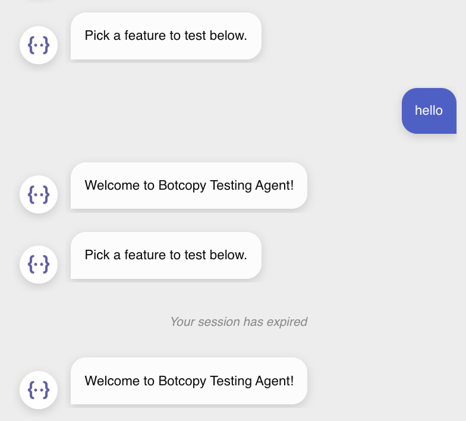
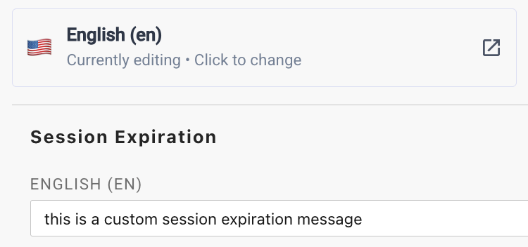
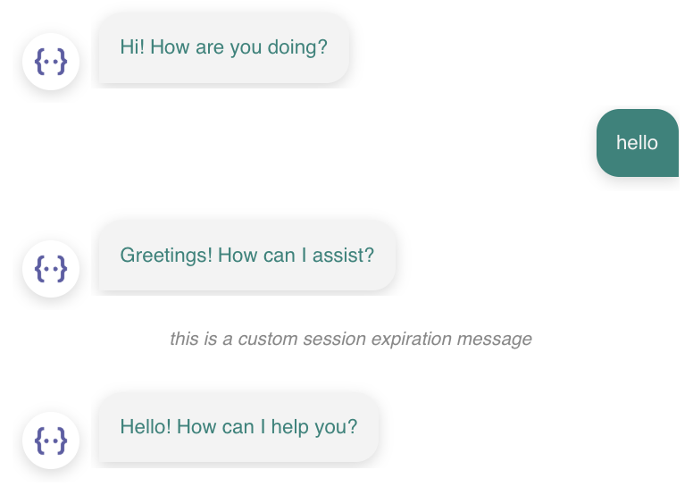

# Session Management

Session duration, end of session behavior, and the messaging displayed to users at the end of sessions can be customized in the chat widget. 

Session duration and end of session behavior can be configured on the Session Management page in Portal. Session Expiration Messaging can be configured under the Session Expiration dropdown on the Localization page.

## Session Duration

Session duration is the time between the last user interaction and the end of the session. A user interaction is defined as any query sent to Dialogflow in the form of a training phrase or an event.

An Intent Prompt counts as a user interaction as a query is sent to Dialogflow. A Preset Prompt does not count as a user interaction.

Session duration can be customized per platform as follows:

| **Platform**  | **Default** | **Lower Bound** | **Upper Bound**         |
|---------------|-------------|-----------------|-------------------------|
| Dialogflow CX | 30 minutes  | 1 minute        | 1440 minutes (24 hours) |
| Dialogflow ES | 20 minutes  | 1 minute        | 20 minutes              |

## End of Session Behavior

When the user session expires, two different behaviors can be configured, "Keep History" and "Clear History". There are two scenarios where a session can expire silently without the end of session behavior taking place: 
- If the user does not interact with the chat during a session. 
- If the user is currently in a live chat with a human agent and their session expires. This ensures the human conversation remains uninterrupted.

### Keep History (default)

This will preserve the conversation history from the previous session and a message is pushed to the chat to act as a divider between the sessions. After the divider is added to the chat, the configured bot prompt is triggered in the new session.

*"Your session has expired" is the default message if a custom one is not set.*

### Clear History

Conversation history is cleared and the configured bot prompt is triggered in the new session. This behavior is the same as if the user clicked the Clear History button.

## Session Expiration Messaging

In "Keep History" mode the message sent that acts as the divider between sessions can be customized on the Localization page under the Session Expiration dropdown. Messaging can be customized for all the languages your bot supports.

*configured custom session expiration message in Portal*

*custom session expiration message shown in the chat*
