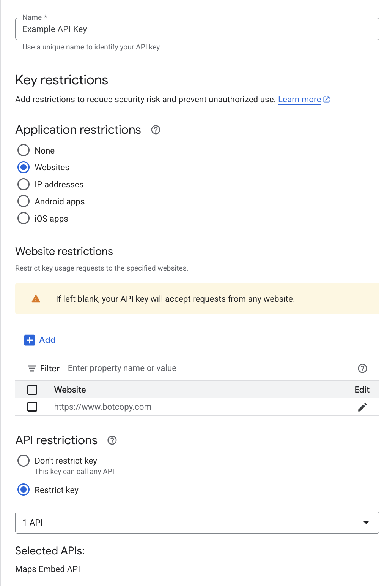

## Google Maps Embed API

[Google Maps Embed API](https://developers.google.com/maps/documentation/embed/embedding-map)

Google Maps Embed URLs use the following format `https://www.google.com/maps/embed/v1/MAP_MODE?key=YOUR_API_KEY&PARAMETERS`.

### Creating an API Key

[Google Maps Platform - Restrict your API keys](https://developers.google.com/maps/api-security-best-practices#restricting-api-keys)

API keys will appear publicly in the `src` attribute of the `iframe` used to embed them. It is recommended to set application and API restrictions on an API key used for embedding maps inside Botcopy. An example configuration of an API key that can only be used for the Maps Embed API and on `https://www.botcopy.com`:



## Usage

Google Maps Embed API links should be set in the `image.url` field of a Card or Carousel item:

```json
{
    "botcopy": [
        {
            "card": {
                // ... other card properties
                "image": {
                    "url": "https://www.google.com/maps/embed/v1/MAP_MODE?key=YOUR_API_KEY&PARAMETERS"
                }
            }
        }
    ]
}
```

```json
{
    "botcopy": [
        {
            "carousel": [
                {
                    // ... other carousel item properties
                    "image": {
                        "url": "https://www.google.com/maps/embed/v1/MAP_MODE?key=YOUR_API_KEY&PARAMETERS"
                    }
                }
            ]
        }
    ]
}
```
